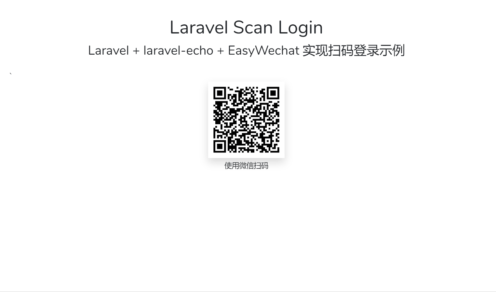

# Laravel + laravel-echo + EasyWeChat 实现微信扫码登录

扫码登录成为一种日趋流行的登录方式，它具有较高的安全性，同时又使我们从记忆大量的账号密码并手动输入的繁琐流程中解脱出来，有些平台甚至无账号也能扫码登录，连注册的麻烦都省了。

对于接入微信开放平台的公众号应用来说，实现扫码登录是相当容易的，有 EasyWeChat SDK 加持，再按着官方的文档一把梭，很快就能完成。
然而本文所要讨论的是另一种情况，有时候出于某些原因，自己的公众号不能接入开放平台，但又想进行微信扫码登录，这种情况下显示就不能再换官方的套路来了。但只要我们稍作变通，就能实现这一需求。

## 基本思路：

1. 登录页显示微信二维码（使用 EasyWeChat SDK 创建，短时效的临时二维码）
2. 用户扫码后推送消息到服务器接口，接口中根据业务情况进行判断处理，符合条件时触发 WechatScanLogin 事件
3. WechatScanLogin 事件实现 ShouldBroadcast 接口，所以当它被触发时也会向指定的频道进行广播
4. 前端 laravel-echo 监听频道中用户扫码登录的消息并进行处理


以下就来介绍一下具体实现，先放效果图。



## 具体实现

> 配合本文，我创建了一个简单的示例项目，有兴趣的可以克隆下来，配合源码一起服用，效果更佳。项目地址：[https://github.com/tianyong90/laravel-qrcode-login](https://github.com/tianyong90/laravel-qrcode-login)

1. 首先当然是创建 Laravel 项目，同时安装前后端依赖

- 前端最主要依赖是 `laravel-echo` 和 `socket.io-client`

> 前端监听事件广播是关键，我们需要一个 websocket 服务端，Laravel 官方文档在介绍消息广播时提到了 Pusher 和 laravel-echo-server。因为我使用 laradock 作为开发环境，其中内置了 laravel-echo-server 容器，十分方便，所以决定直接用它。实际上也可以使用 Pusher 服务，那么则需要安装 pusher.js 替代 socket.io-client，同时在 .env 中修改相关配置

2. 配置项目

主要是配置数据库和 redis 连接，然后把 BROADCAST_DRIVER 设置为 redis(这一点很重要，如果使用 pusher 则需要修改为 pusher)

如果 QUEUE_CONNECTION 设置为 redis 了，则需要记得启动队列 worker.

3. 启动 laravel-echo-server

因为使用 laradock，所以只需要启动时带上 laravel-echo-server 参数就可以了，进入 laradock 目录

```bash
docker-compose up -d nginx php-worker nginx mysql redis laravel-echo-server
```

4. 创建 WechatScanLogin 事件

```shell
php artisan make:event WechatScanLogin
```

```php
class WechatScanLogin implements ShouldBroadcast
{
    use Dispatchable, InteractsWithSockets, SerializesModels;

    public $token;

    /**
     * Create a new event instance.
     *
     * @param $token
     */
    public function __construct($token)
    {
        $this->token = $token;
    }

    /**
     * Get the channels the event should broadcast on.
     *
     * @return \Illuminate\Broadcasting\Channel|array
     */
    public function broadcastOn()
    {
        return new Channel(‘scan-login’);
    }
}
```

> 上面最关键的就是事件要实现 ShouldBroadcast 接口并在 broadcastOn 方法中指定要广播的频道。WechatScanLogin 的公开属性 token 会自动包含在广播数据中。

5. 对接微信消息服务器

> laravel-wechat 的相关配置和对接，请阅读 EasyWeChat SDK 官方文档。

接收扫码的消息并进行相关处理。

```php
public function serve()
{
    $app = app('wechat.official_account');

    $app->server->push(function ($message) {
        if ($message['Event'] === 'SCAN') {
            $openid = $message['FromUserName'];

            $user = User::where('openid', $openid)->first();

            if ($user) {
                // TODO: 这里根据情况加入其它鉴权逻辑

                // 使用 laravel-passport 的个人访问令牌
                $token = $user->createToken($user->name)->accessToken;

                // 广播扫码登录的消息，以便前端处理
                event(new WechatScanLogin($token));

                \Log::info('haha login');
                return '登录成功！';
            }

            return '失败鸟';
        } else {
            // TODO： 用户不存在时，可以直接回返登录失败，也可以创建新的用户并登录该用户再返回
            return '登录失败';
        }
    }, \EasyWeChat\Kernel\Messages\Message::EVENT);

    return $app->server->serve();
}
```

6. 使用 EasyWeChat 创建临时二维码并在页面中显示。

```php
public function index()
{
    $wechat = app('wechat.official_account');

    $result = $wechat->qrcode->temporary('foo', 600);
    $qrcodeUrl = $wechat->qrcode->url($result['ticket']);

    return view('index', compact('qrcodeUrl'));
}
```

```html
>
```

7. 前端使用 laravel-echo 订阅对应的微信扫码登录事件，接收其中的 token 并存入本地存储作为判断是否登录的凭据，同时这个 token 也将作为访问后端 api 的授权依据。注意前面的代码中，使用了 laravel-passport 生成这个个人访问令牌，如果不了解这部分原理，请查阅 Laravel 官方文档。

```js
import Echo from 'laravel-echo'
import io from 'socket.io-client'

window.io = io

let EchoInstance = new Echo({
  broadcaster: 'socket.io',
  host: window.location.hostname + ':6001',
})

EchoInstance.channel('scan-login').listen('WechatScanLogin', e => {
    localStorage.setItem('my_token', this.token)

    // 其它处理
  })
```

## 总结

至此，简单的扫码登录就完成了。当然，本文示例代码不怎么优雅、流程可能也有不完善的地方，主要是为了提供一个大致思路。有了这个思路，我们可以实现其它诸如扫码签到、扫码投票等各种功能，具体如何就看大家的创意了。
