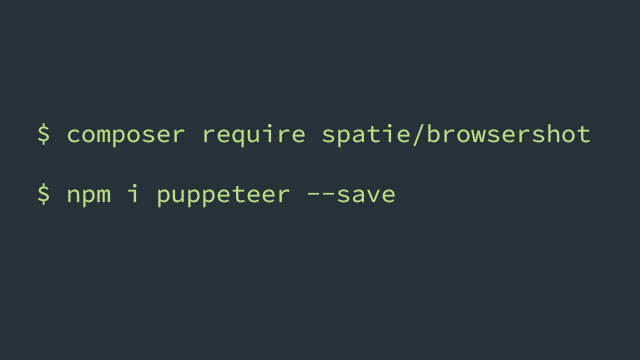

# Laravel 中使用 puppeteer 采集异步加载的网页内容



采集网页内容是一项很常见的需求，比较传统的静态页面，curl 就能搞定。但如果页面中有动态加载的内容，比如有些页面里通过 ajax 加载的文章正文内容，又如果有些页面加载完成后进行了一些额外处理（图片地址替换等等……）而你想采集这些处理过后的内容。那么牛逼闪闪的 curl 也束手无策了。

做过类似需求的人可能会说，老铁，上 PhantomJS 啊！

没错，这是一个办法，而且在相当长的时间里 PhantomJS 是为数不多的能解决这类需求的工具里的佼佼者。

但今天这里要介绍的是一个后来居上的工具 -- puppeteer，它是随着 Chrome Headless 技术兴起而快速发展起来的。而且非常关键的是，puppeteer 由 Chrome 的官方团队开发和维护，可以说相当靠谱了！

puppeteer 是一个 js 包，要想在 Laravel 中使用，得借助于另一神器`spatie/browsershot`。

## 安装

1. 安装 [spatie/browsershot](https://github.com/spatie/browsershot)

    browsershot 是一个 composer 包，出自于大神团队 [spatie](https://github.com/spatie)

```bash
$ composer require spatie/browsershot
```

2. 安装 [puppeteer](https://github.com/GoogleChrome/puppeteer)

```shell
$ npm i puppeteer --save
```

> **也可以全局安全 puppeteer 但就个人经验而言，在项目中安装是比较推荐的做法，因为这样不同项目不会同时受全局安装的 puppeteer 影响，此外项目中安装也方便使用 phpdeployer 进行升级（phpdeploy 升级时不会影响线上项目运行，要知道升级/安装 puppeteer 可是很费时的，有时候还不能保证一次成功）。**

> 安装 puppeteer 时会下载 Chromium-Browser，鉴于咱特殊国情，很有可能出现无法下载的情况，对此，就请大家各显神通吧……

## 使用

以采集今日头条手机版页面文章内容为例。

```php
use Spatie\Browsershot\Browsershot;

public function getBodyHtml()
{
    $newsUrl = 'https://m.toutiao.com/i6546884151050502660/';
    
    $html = Browsershot::url($newsUrl)
        ->windowSize(480, 800)
        ->userAgent('Mozilla/5.0 (Linux; Android 6.0; Nexus 5 Build/MRA58N) AppleWebKit/537.36 (KHTML, like Gecko) Chrome/63.0.3239.132 Mobile Safari/537.36')
        ->mobile()
        ->touch()
        ->bodyHtml();

    \Log::info($html);
}
```

运行后可以在日志中看到如下内容（截图中只是其中部分）


此外，也可以将页面保存为图片或 PDF 文件。

```php
use Spatie\Browsershot\Browsershot;

public function getBodyHtml()
{
    $newsUrl = 'https://m.toutiao.com/i6546884151050502660/';
    
    Browsershot::url($newsUrl)
        ->windowSize(480, 800)
        ->userAgent('Mozilla/5.0 (Linux; Android 6.0; Nexus 5 Build/MRA58N) AppleWebKit/537.36 (KHTML, like Gecko) Chrome/63.0.3239.132 Mobile Safari/537.36')
        ->mobile()
        ->touch()
        ->setDelay(1000)
        ->save(public_path('images/toutiao.jpg'));
}
```


图片里那些框与系统字体有关。代码中使用了一个 setDelay() 方法，是为了让内容加载完成后再进行截图，简单粗暴，可能不是最好的解决办法。

## 可能出现的问题

- 系统得支持 Chromium 浏览器，当然现在绝大部分浏览器是支持的，要不然也没法，还是用 PhantomJS 吧。

- 项目中安装了 puppeteer 后调用时有可能出现权限问题，这就需要对项目下 /node_modules/puppeteer 目录赋予适当的权限。

## 总结

puppeteer 被应用于测试、采集等场景，是一个非常有力的工具。对于轻度的采集任务，是够用的，比如本文这类在 Laravel (php) 里来用采集一些小页面，但如果需要快速采集大量内容，还是 Python 啥的吧。:smile:
