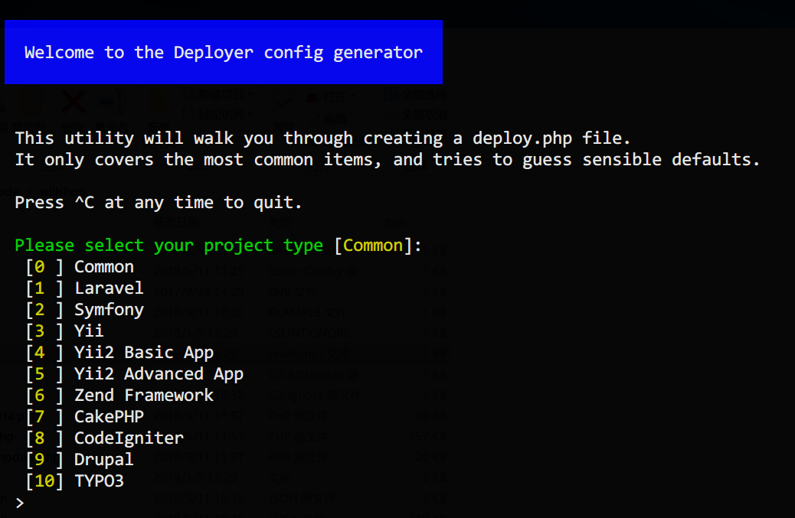
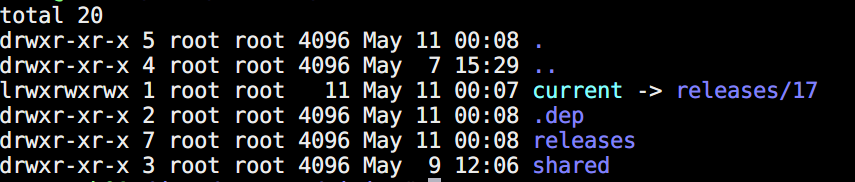

# deployer 实战经验分享

开发完项目，免不了要部署上线。

laravel 的官方文档里介绍了 Envoy，之前用过，能满足大部分场景，但仍然有一些限制。直到后来看到了 deployer,


## deployer 的优势

1. 真正解放双手，一条命令完成部署。

2. 进行部署的过程中，项目仍然能够正常访问。部署成功完成后才切到新的版本。

3. 能十分方便地进行回滚。

4. 丰富任务钩子和预置任务可灵活的组合完成各种任务，比如执行前端依赖的安装、构建等。

5. 其它骚姿势等你发掘……

## 使用 deployer 的前提条件

- 本地机器（也就是你执行 dep 命令时所在的机器）能够 SSH 连接到目标机器（代码要部署到的机器，不管是在线的云主机还是局域网中的虚拟机）

- 有登录目标机器并调整一些设置的权限，或者能让负责人调整。（因为使用过程中可能遇到问题需要调整一些设置，后面会提）

- 目标主机有提取相关项目 git 仓库的权限。（这个应该都有吧，不然玩个毛？）

- 足够大胆、足够细心、足够有耐性…… :smile:

## deployer 的使用

首先说明下个人实际使用场景。

本人使用 win10 系统，使用 Homestead 作为 PHP 项目的开发环境（vagrant v2.1.1, homestead v7.4.1, virtualbox v5.2.8, homestead 的 virtual box 版本为 v5.2）。

本地开发能完成绝大部分开发和测试任务，但在部署到生产机之前仍然需要先部署到开发机上进行测试。线上测试与生产使用的是青云的云主机，Ubuntu16 系统。

> **以下的操作都是在 homestead 虚拟机里进行操作！**

1. 安装

```bash
cd /path/to/your/project

composer require deployer/deployer --dev
```

> 个人习惯于将其作为项目依赖安装，当然也可以根据需要或个人喜好全局安装。

2. 初始化 deployer 配置文件

```bash
vendor/bin/dep init
```

因为我用的是 laravel 输入项目类型 1 后回车,然后会出现一个让设置 git 仓库的，默认是对应项目的 git 远端仓库，不需要修改的话确认就可以了。



完成上面的初始化后，项目要目录下会出现一个 deploy.php 文件，deployer 的配置就靠它了。初始的配置如下，里面显示了一些基本的配置。

```php
<?php
namespace Deployer;

require 'recipe/laravel.php';

// Project name
// 项目名
set('application', 'my_project');

// Project repository
// 项目仓库地址不解释
set('repository', 'git@github.com:tianyong90/xxx.git');

// [Optional] Allocate tty for git clone. Default value is false.
set('git_tty', true); 

// Shared files/dirs between deploys 
// 分享文件即目录，通常也不用改，默认包含了 storage 目录
add('shared_files', []);
add('shared_dirs', []);

// Writable dirs by web server 
// 可写目录，一般不用改
add('writable_dirs', []);


// Hosts
// 目标主机配置，这是最基本的
host('project.com')
    ->set('deploy_path', '~/{{application}}');    
    
// Tasks
// 这算是个自定义任务示例
task('build', function () {
    run('cd {{release_path}} && build');
});

// [Optional] if deploy fails automatically unlock.
// 如果部署失败，自动解除部署锁定状态，以免影响下次执行
after('deploy:failed', 'deploy:unlock');

// Migrate database before symlink new release.
// 执行数据库迁移，建议删掉，迁移虽好，但毕竟高风险，只推荐用于开发环境。
before('deploy:symlink', 'database:migrate');
```

3. 修改配置

默认的配置肯定是不行的，目标主机啥的还不知道呢。下面直接贴上自己用到的配置，并加入了少量说明。

```php
<?php

namespace Deployer;

require 'recipe/laravel.php';

// Project name
set('application', 'xxx');

// Project repository
set('repository', 'git@github.com:tianyong90/xxx.git');

// [Optional] Allocate tty for git clone. Default value is false.
set('git_tty', true);

// Shared files/dirs between deploys
add('shared_files', []);
add('shared_dirs', []);

// Writable dirs by web server
add('writable_dirs', []);

// 保存最近五次部署，这样的话回滚最多也只能回滚到前 5 个版本
set('keep_releases', 5);

// 实践证明，这样能减少一些不必要的麻烦
set('writable_use_sudo', false);

// 生产用的主机
host('172.16.1.1')
    ->stage('production')
    ->user('root')
    ->port(22)
    ->set('branch', 'master') // 最新的主分支部署到生产机
    ->set('deploy_path', '/data/wwwroot/xxx')
    ->identityFile('/home/vagrant/.ssh/id_rsa')
    ->forwardAgent(true)
    ->multiplexing(true)
    ->set('http_user', 'www') // 这个与 nginx 里的配置一致
    ->addSshOption('UserKnownHostsFile', '/dev/null')
    ->addSshOption('StrictHostKeyChecking', 'no');

// 测试用的主机
host('172.16.3.2')
    ->stage('debug')
    ->user('root')
    ->port(22)
    ->set('branch', 'develop') // 一般是把 develop 分支弄到测试机测试，没问题再合并
    ->set('deploy_path', '/data/wwwroot/xxx')
    ->identityFile('/home/vagrant/.ssh/id_rsa')
    ->forwardAgent(true)
    ->multiplexing(true)
    ->set('http_user', 'www')
    ->addSshOption('UserKnownHostsFile', '/dev/null')
    ->addSshOption('StrictHostKeyChecking', 'no');

// 自定义任务：重置 opcache 缓存
task('opcache_reset', function () {
    run('{{bin/php}} -r \'opcache_reset();\'');
});

// 自定义任务：重启 php-fpm 服务
task('php-fpm:restart', function () {
    run('systemctl restart php-fpm.service');
});

// 自定义任务：supervisor reload
task('supervisor:reload', function () {
    run('sudo supervisorctl reload');
});

// 自定义任务：部署成功了用 bearychat 发消息给大佬和自己
task('send_message', function () {
    run('{{bin/php}} {{release_path}}/artisan deployed');
});

// 自定义任务：缓存路由，recipe/laravel.php 默认的流程里没有这个，所以加上，息看需要
after('artisan:config:cache', 'artisan:route:cache');

// 执行自定义任务，注意时间点是 current 已经成功链向新部署的目录之后
after('deploy:symlink', 'php-fpm:restart');
after('deploy:symlink', 'supervisor:reload');

// 部署成功后重置 opcache 缓存
after('deploy:symlink', 'opcache_reset');

// 部署成功后调用 laravel 命令行发送通知
after('success', 'send_message');

// [Optional] if deploy fails automatically unlock.
after('deploy:failed', 'deploy:unlock');
```


4. 代码修改完成后运行部署

修改完成后记得先提交并将代码推送到远端仓库。然后执行如下命令进行部署：

```bash
vendor/bin/dep deploy debug // 部署到测试机

vendor/bin/dep deploy production // 部署到生产机
```

过程中如果提示要输入密码，则输入登录目标主机的密码。或者想办法设置 SSH key 实现免密码登录。

5. 首次部署后设置 .env，并配置 nginx 站点

默认情况下，首次部署后，.env 文件是不会自动创建的，需要自己创建并修改，同时 nginx 站点配置也需要自己动手。对于 .env 文件，存放于目标主机的 `/path/to/project/shared/` 目录下。

**修改 .env 后记得重新缓存配置 `php artisan config:cache`**

另外需要注意的是配置 nginx 站点时，网站根目录应该为 **`/path/to/project/current/public`**。如果使用 supervisor 之类的，相关的目录在配置时也要注意了。


## 部署后目录的结构及相关说明

在部署的目标目录下执行 `ls -la`，可以看到如下结果：



说明：
```
| projectname
    |--- @current -> releases/<num>
    |--- .dep
        |--- releases 一个文本文件，里面存着各次部署的时间、次数序号（或者说版本号）信息
    |--- releases // 目录下根据配置保存近几次部署，更早的则会被自动清理
        |--- 1
        |--- 2
        |--- .
        |--- .
        |--- <num>
            |--- 目录中是项目的实际代码
            |--- 包括 .git, vendor, .env, storage ...
            |---  .env, storage 实际通过 symlink 链接到 shared 目录下对应的文件上
    |--- shared
        |--- storage // 即 laravel 项目的 storage 文件夹
        |--- .env // 即 laravel 项目的 .env

```

每次部署更新，会在 releases 下新建文件夹如 num，拉取对应的最新代码，安装 composer 依赖完成一些其它自定义任务，并将 storage, .env 链接到 shared 文件夹下的那两个上去，然后项目根目录下的 current 通过 syslink 链接到这个新文件夹 num 上，这算是其动作的基本原理，网站在部署过程中能继续访问也得益于此。

.env 和 storage 下的一些未加入代码库中的内部，部署时不会自动更新，因此有些情况下需要手动处理。

## 其它日常使用技巧

正常情况下，部署过程中 deployer 会自动完成缓存配置、清理已编译的缓存等任务。理论上我们不需要自己再动手，但需要时也可以手动执行

```bash
// 缓存路由
vendor\bin\dep artisan:route:cache production

// 缓存配置
vendor\bin\dep artisan:config:cache production

// 清视图缓存
vendor\bin\dep artisan:view:clear production

// 执行自定义任务，如前面提到的重新载入 supervisor
vendor\bin\dep supervisor:reload production

// ssh 连接到主机,hostname 也可以不输入，然后从选项里选
vendor\bin\dep ssh <hostname>

// 列出其它一些可用的命令
vendor\bin\dep list
```

## 可能遇到的问题

> **在 deploy 命令后加上 -vvv 选项可以输入详细错误信息，方便调试。**

1. 由于部分 php 函数被禁用而报错

目标主机 `php.ini` 里的 `disabled_functions` 项里配置了一些被禁用的函数，如果 deployer 用到了这些函数就可能报错，修改 `php.ini` 解除相关函数的禁用状态就可以了。

2. php 执行文件位置引起的错误

目标主要通过 apt-get 命令或 oneinstack 一类的一键包安装的 PHP，可执行文件通常在 `/usr/local/php/bin/php`,而 deployer 内使用 /usr/bin/env: php 形式调用，相当于 `/usr/local/bin/php`。这就可能出错，一般是报 `command -v 'php' failed`。解决办法很简单，只要加个软链接就可以了。

```bash
ln -s /usr/local/php/bin/php /usr/local/bin/php
```

3. 目录主机不在线或者网络连接问题

解决办法当然是打开目录主机并检查网络情况

4. 关于缓存清理

deployer 的 laravel 默认部署流程中，会执行 php artisan cache:clear 命令，如果你的项目里使用了 redis 驱动的队列或者一些强依赖于缓存的业务逻辑（如缓存文章阅读数定期再入库），则需要进行一些骚操作了。

比如，你可以在 `config/database.php` 的 `redis` 项中为队列链接指定其它的 database。

或者修改 `deploy.php` 配置默认的缓存清理任务，跳过缓存清理动作。（通常并不建议这么做，因为项目的缓存，应该是可清理的，如果部分业务确实十分依赖于缓存，则应该考虑一些缓存持久化的实现了）

```php
// 覆盖 recipe/laravel 里默认的 artisan:cache:clear 任务，部署时不清缓存
task('artisan:cache:clear', function () {
    return true;
});
```
