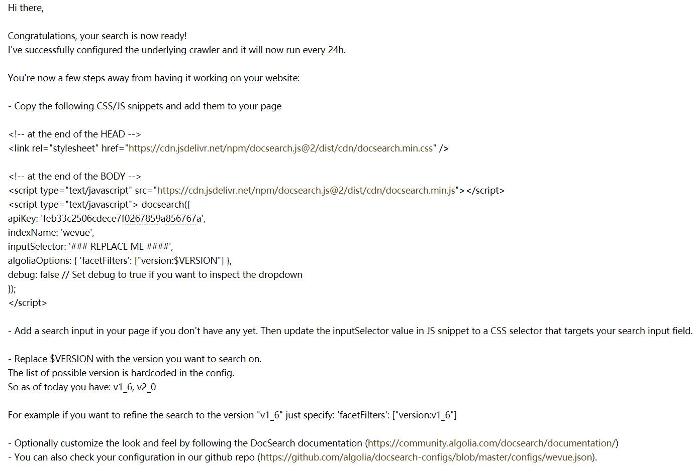

# 用 Algolia DocSearch 轻松实现文档全站搜索

据说，有两件事能让程序员抓狂，一是写文档，二是用别人的代码发现没文档。

确实如此，

烂的文档千篇一律，有趣的文档沁人心脾


 [Algolia DocSearch](https://community.algolia.com/docsearch/)

## DocSearch 的基本原理和优势


## 实现步骤

1. 在 [Algolia DocSearch 官网](https://community.algolia.com/docsearch/) 填写自己的文档网站的地址和邮箱进行申请

DocSearch 可以免费使用，而且不用注册，因为他们觉得，任何人都应该能够有能力构建方便搜索的文档（可以说相当有情怀吧）。当然，也有收费的服务可供选用，差异在于技术支持和请求频率限制等方面不同。

2. 收到确认邮件并确认

提交申请之后不久，你所填写的邮箱就会收到一封询问邮件。里面说明你的网站技术上是否支持写用 DocSearch。如果支持，还会询问你是否能修改源码向其中注入需要的代码。你需要回复并确认。

3. DocSearch 对你的文档网站首次爬取页面数据，并向你发送需要注入的代码及相关操作指导。

第 2 和 第 3 步都需要对方人工处理，而且根据你的网站复杂程序，需要等待的时间会有差异，不过就我个人经验而言还是很快的。前后不到两个小时。

邮件内容大致如下：



4. 根据第 3 步里收到的邮件提示，修改网站代码

可以看到，邮件主要包括 apiKey 等配置信息，而且对于如何使用也描述得非常清楚了。系统甚至分析出我网站 url 中使用了 v1_6 和 v2_0 区分不同版本的文档，并为此提供相关的参数 `algoliaOptions: { 'facetFilters': ["version:$VERSION"] }, ` 以及详细使用例子说明，简直无微不至，催人尿下……

因为自己网站用 vue 单文件组件写的，所以并没有完全照着邮件里的来。

先在，模板文件 `index.html' 的 head 中按邮件里那样加入 docsearch 的样式。

然后，安装 docsearch.js 包

```bash
yarn add -D docsearch.js
```

修改文档页面组件，加入搜索输入框和 docsearch 初始化代码

```html
<template>
  <header>
    <input
      v-show="$route.path.indexOf('/doc') === 0"
      type="text"
      class="search-input"
      id="search_input"
      placeholder="搜索文档"
    >
  </header>
</template>

<script>
import docsearch from 'docsearch.js'

export default {
  mounted () {
    docsearch({
      apiKey: 'feb33c2506cdece7f0267859a856767a',
      indexName: 'wevue',
      inputSelector: '#search_input',
      algoliaOptions: { 'facetFilters': ['version:v2_0'] },
      debug: false // Set debug to true if you want to inspect the dropdown
    })
  }
}
</script>
```

> **注意：为了示例代码简洁，上述代码仅贴出了直接相关的部分。若有兴趣，可前往 [we-vue](https://github.com/tianyong90/we-vue) 查看实际使用情况**

最后根据自己的喜好及需要，调整下搜索框及搜索下拉弹出层的样式。就完工了。


## 总结

Algolia DocSearch 可以说真如其官网描述的那样，算是目前构建可在线搜索文档的最简单的方式之一了。你只需要关注文档本身，进行少量的配置之后，其它的 Algolia 全包了。另外，Algolia 还有一些其它优秀产品及服务，诸位可前往官网自行探索。

本文以自己的项目为例，但 Aloglia DocSearch 适合很多类型的网站，使用 [Vue.js 官网](https://vuejs.org)这类用 HEXO 构建的静态站，又或者像 [Easywechat](https://easywechat.com) 一样用 Laravel 开发的动态网站（事实上自己早前曾向超哥安利过 DocSearch, 然后竟然真被用上了 :smile: ）。有了搜索功能之后，用户能更方便有找到自己想要的信息，当然，网站的格调也极大的提升了！
