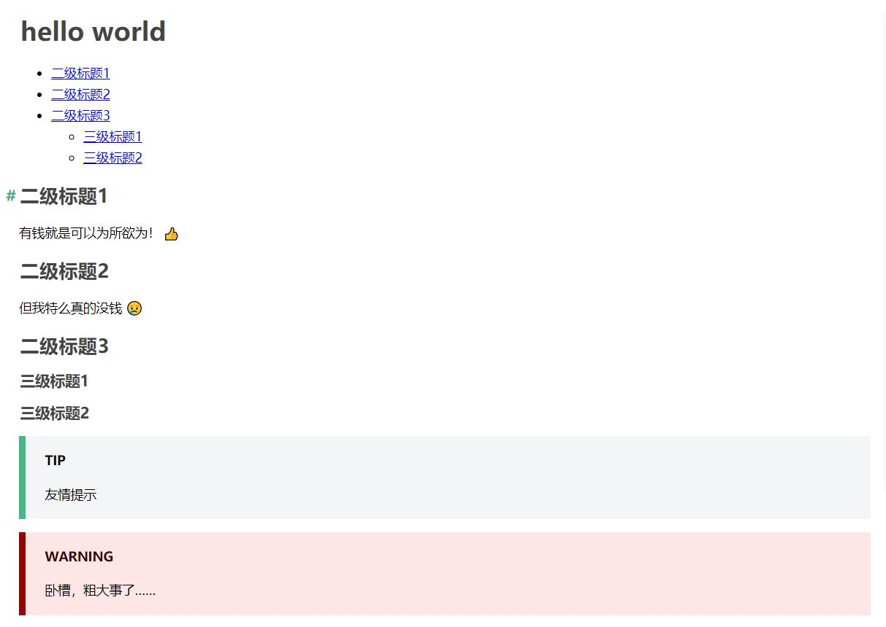

# 自己撸个 vue markdown loader

最近，当我把 vue-loader 升级到 v15 后发现，自己项目中所使用的一个 vue-markdown-loader 因为兼容问题而没法用了，正当我一筹莫展的时候，无意间看到 vuepress 中使用了当时还处于 v15.0.0 rc 版本的 vue-loader,仔细研究其源码后发现，vuepress 对于 markdown 的支持相当完善，而且代码也规范易懂。于是心生一计，把里面部分相关的代码拿出来魔改一番，做成一个新的 loader 用到自己的项目……

## 关于 webpack loader

为了干这个，首先得理解 webpack 的 loader 的功能和原理。

> loader 用于对模块的源代码进行转换。loader 可以使你在 import 或"加载"模块时预处理文件。因此，loader 类似于其他构建工具中“任务(task)”，并提供了处理前端构建步骤的强大方法。loader 可以将文件从不同的语言（如 TypeScript）转换为 JavaScript，或将内联图像转换为 data URL。loader 甚至允许你直接在 JavaScript 模块中 import CSS文件！（摘自 webpack 官方中文文档）

由此可见，loader 就像是一个“处理器”，输入特定的内容，处理后进行输出。当必要时，可以把一些合适的 loader 串起来使用，使前一个 loader 的输出变成后一个 loader 的输入，最终得到自己想要的结果。

对于本文要提到的 markdown-loader 来说，它需要进行的处理就是，将 markdown 文件内容解析并包装成一个与 vue 单文件组件内容相似的，然后传给它后面的 vue-loader, 所以一个最简单的 vue markdown-loader 可以长这德性：

```js
module.exports = function (src) {
  const res = (
    `<template>\n` +
    `<h1>hello world</h1>\n` +
    `</template>`
  )
  return res
}
```

当然，这个 loader 看起来有点儿智障，因为不管传给它什么，最后输出来的都一样的玩意儿。但它确实做一个 loader 通常做的事…… :smile:

下面进入正题，要做一个处理 markdown 的 loader 其逻辑要复杂得多，但实质与上面的差不多，首先我们需要安装一些必要的包。

## 安装需要的包

```bash
yarn add -D markdown-it markdown-it-anchor markdown-it-container markdown-it-emoji markdown-it-table-of-contents
```

| 包名称 | 功能说明 |
| ---- | ---- |
| markdown-it | 渲染 markdown 基本语法 |
| markdown-it-anchor | 为各级标题添加锚点 |
| markdown-it-container | 用于创建自定义的块级容器 |
| markdown-it-emoji | 渲染 emoji |
| markdown-it-table-of-contents | 自动生成目录 |
| highlight.js | 代码高亮 |

## 编写 loader

在这个 loader 里，传入的是 markdown 文件的源文件，也就是没作任何解析的内容，我们需要对它进行一些处理，包括解析基本语法、渲染 emoji、添加锚点等处理，并定义一些自定义的块，比较关键的就是，最后要把这些内容包裹到 `<template>` 标签中，不然接下来处理它们的 vue-loader 处理不了。

贴上 loader 的代码：

```js
const fs = require('fs')
const path = require('path')
const hash = require('hash-sum')
const LRU = require('lru-cache')
const hljs = require('highlight.js')

// markdown-it 插件
const emoji = require('markdown-it-emoji')
const anchor = require('markdown-it-anchor')
const toc = require('markdown-it-table-of-contents')

// 自定义块
const containers = require('./containers')

const md = require('markdown-it')({
  html: true,
  // 代码高亮
  highlight: function (str, lang) {
    if (lang && hljs.getLanguage(lang)) {
      try {
        return '<pre class="hljs"><code>' +
          hljs.highlight(lang, str, true).value +
          '</code></pre>'
      } catch (__) {}
    }

    return '<pre v-pre class="hljs"><code>' + md.utils.escapeHtml(str) + '</code></pre>'
  }
})
  // 使用 emoji 插件渲染 emoji
  .use(emoji)
  // 使用 anchor 插件为标题元素添加锚点
  .use(anchor, {
    permalink: true,
    permalinkBefore: true,
    permalinkSymbol: '#'
  })
  // 使用 table-of-contents 插件实现自动生成目录
  .use(toc, {
    includeLevel: [2, 3]
  })
  // 定义自定义的块容器
  .use(containers)

const cache = LRU({ max: 1000 })

module.exports = function (src) {
  const isProd = process.env.NODE_ENV === 'production'

  const file = this.resourcePath
  const key = hash(file + src)
  const cached = cache.get(key)

  // 重新模式下构建时使用缓存以提高性能
  if (cached && (isProd || /\?vue/.test(this.resourceQuery))) {
    return cached
  }

  const html = md.render(src)

  const res = (
    `<template>\n` +
    `<div class="content">${html}</div>\n` +
    `</template>\n`
  )
  cache.set(key, res)
  return res
}
```

> 以下为上面代码中引用到的 containers.js 中代码
```js
const container = require('markdown-it-container')

module.exports = md => {
  md
    .use(...createContainer('tip', 'TIP'))
    .use(...createContainer('warning', 'WARNING'))
    .use(...createContainer('danger', 'WARNING'))
    // explicitly escape Vue syntax
    .use(container, 'v-pre', {
      render: (tokens, idx) => tokens[idx].nesting === 1
        ? `<div v-pre>\n`
        : `</div>\n`
    })
}

function createContainer (klass, defaultTitle) {
  return [container, klass, {
    render (tokens, idx) {
      const token = tokens[idx]
      const info = token.info.trim().slice(klass.length).trim()
      if (token.nesting === 1) {
        return `<div class="${klass} custom-block"><p class="custom-block-title">${info || defaultTitle}</p>\n`
      } else {
        return `</div>\n`
      }
    }
  }]
}
```

## 使用

写好了 loader，就可以在 webpack 里使用了，在配置的  `module.rules` 数组中加入如下规则：

```js
{
  test: /\.md$/,
  use: [
    {
      loader: 'vue-loader', // 这里的使用的最新的 v15 版本
      options: {
        compilerOptions: {
          preserveWhitespace: false
        }
      }
    },
    {
      // 这里用到的就是刚写的那个 loader
      loader: require.resolve('./markdownLoader')
    }
  ]
},
```

然后，就可以在自己的组件中引入 markdown 文件了。假如你有一个名叫 something-cool.md 的文件里有下面这样的内容:

```md
# hello world

[[toc]]

## 二级标题1

有钱就是可以为所欲为！ :+1:

## 二级标题2

但我特么真的没钱 :cry:

## 二级标题3

### 三级标题1

### 三级标题2

:::tip
友情提示
:::

:::danger
卧槽，粗大事了……
:::

```

在你的 vue 项目中就可以有如下姿势：

```html
<template>
  <my-markdown/>
</template>

<script>
export default {
  components: {
    'my-markdown': () => import('./something-cool.ms')
  }
}
</script>
```
结果：



> 说明：上图的渲染结果，涉及到一些 css 样式，本文就不一一列出了，因为很长……

## 其它

可以看到，写个 loader 其实也是蛮简单的，了解其中原理之后，你甚至可以创建自创格式的文件和扩展名，然后写个 loader 处理/加载这类文件，是不是很骚？！:smile:

正如开头提到的，loader 中的代码，借鉴自 vuepress,感谢其开发组人员并尊重其版权，如果大家有兴趣可自己前往查看该项目，本人也并不打算装这个 loader 封装成包并发布，它仅仅是为了自己项目需要折腾的，十分粗陋。

最后，放出自己用到这个 `loader` 的项目地址，算是广告一波。:smile:

[we-vue GitHub 地址](https://github.com/tianyong90/we-vue)

[we-vue 在线文档](https://wevue.org)
